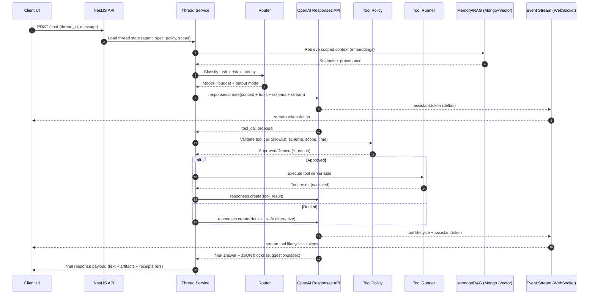

# Message Turn Sequence: End-to-End Runtime Flow

> **How a single message turn executes from user input to final response**

---

## 🔄 Overview

This diagram shows the **runtime execution flow in time order** for a single message turn through the ChatAndBuild agent platform. It traces the complete journey from user message submission through thread loading, memory retrieval, model routing, tool execution, and streaming response delivery.

**Use this when someone asks: "How does a turn actually run?"**

---

## 📊 Sequence Diagram

---

## 🎯 Step-by-Step Breakdown

### **Phase 1: Request & Context Loading (Steps 1-4)**

1. **User submits message**: Client UI sends `POST /chat` with `thread_id` and message content
2. **Thread state loaded**: Thread Service retrieves agent spec, tool policy, and memory scope from MongoDB
3. **Memory retrieval**: RAG system queries vector index for relevant snippets using `text-embedding-3-small`
4. **Context assembled**: Snippets with provenance (source, timestamp, relevance score) returned to Thread Service

### **Phase 2: Routing & Model Selection (Steps 5-6)**

5. **Task classification**: Router analyzes message for task class (reasoning/json/microtask/voice/code), risk level, and latency requirements
6. **Model assignment**: Router returns appropriate model (GPT-4 class for reasoning, fast models for microtasks, etc.) with budget and output mode

### **Phase 3: Responses API Invocation (Steps 7-9)**

7. **Stream initiated**: Thread Service calls OpenAI Responses API with:
   - Assembled context (thread history + retrieved snippets)
   - Tool definitions from agent spec
   - JSON schema for structured outputs
   - Streaming enabled
8. **Token streaming begins**: Responses API streams `assistant.token` deltas
9. **UI receives tokens**: Event Stream (WebSocket) forwards token deltas to Client UI for real-time display

### **Phase 4: Tool Execution Loop (Steps 10-17)**

10. **Tool call proposed**: Responses API suggests a tool call with arguments
11. **Policy validation**: Tool Policy validates against:
    - Allowlist (is tool permitted?)
    - Schema (do arguments match expected format?)
    - Scope (does tool respect thread/user/workspace bounds?)
    - Time (is execution within budget?)
12. **Approval decision**: Policy returns Approved/Denied with reason

**If Approved (Steps 13-15):**
13. Tool Runner executes tool server-side in sandboxed environment
14. Tool result sanitized and returned to Thread Service
15. Thread Service submits tool result back to Responses API

**If Denied (Step 16):**
16. Thread Service submits denial message with safe alternative to Responses API

17. **Tool lifecycle streamed**: Event Stream forwards tool lifecycle events (proposed → executing → completed/denied) and continued token deltas to UI

### **Phase 5: Final Response (Steps 18-19)**

18. **Completion**: Responses API returns final answer with:
    - Text response
    - JSON blocks (suggestions for next actions, updated agent spec if applicable)
19. **Payload delivered**: Thread Service sends complete response to UI with:
    - Final text
    - Structured artifacts (suggestions/spec)
    - Receipt references for audit trail

---

## 🔑 Key Architectural Patterns

### **Streaming-First Design**
- Token deltas stream immediately (TTFT <500ms for text, <100ms for voice)
- Tool lifecycle events stream in real-time for transparency
- UI updates progressively, never blocking on completion

### **Server-Side Tool Execution**
- All tools run server-side with strict sandboxing
- No client-side execution for security
- Results sanitized before returning to model

### **Policy-Driven Security**
- Every tool call validated against allowlist and schema
- Scope and time bounds enforced
- Denied calls receive safe alternatives, never silent failures

### **Memory-Augmented Context**
- Embeddings-backed retrieval scoped to thread/user/workspace
- Provenance tracked for every snippet
- Relevance scoring ensures quality context

### **Observable Execution**
- Every step emits events for monitoring
- Tool lifecycle visible to end users
- Audit trail captured in receipts

---

## 📈 Performance Characteristics

| Metric | Target | Notes |
|--------|--------|-------|
| **TTFT** | <500ms (text), <100ms (voice) | Time to first token streamed to UI |
| **Memory Retrieval** | <200ms | Vector search + snippet assembly |
| **Tool Validation** | <50ms | Policy check against allowlist/schema |
| **Tool Execution** | <2s | Most tools, some may take longer with user approval |
| **End-to-End Latency** | <3s | Complete turn for typical interactions |

---

## 🛡️ Security Guarantees

- **Zero Trust**: Every tool call validated, no implicit permissions
- **Scope Isolation**: Memory retrieval respects thread/user/workspace boundaries
- **Audit Trail**: Every action logged with receipts for compliance
- **Sandboxed Execution**: Tools run in isolated environments with resource limits
- **Schema Enforcement**: All inputs/outputs validated against defined schemas

---

## 🔄 Error Handling

- **Tool Denial**: Safe alternatives provided, execution continues
- **Timeout**: Tools exceeding time budget terminated gracefully
- **Schema Violation**: Invalid outputs rejected, user notified
- **API Failure**: Graceful degradation with retry logic
- **Memory Retrieval Failure**: Falls back to thread history only

---

## 📚 Related Documentation

- [Systems Architecture](./README.md) - Four-plane architecture overview
- [Evals Harness](./EVALS_HARNESS.md) - Behavioral regression testing
- [Tool Policy](./TOOL_POLICY.md) - Security and validation rules
- [Memory & RAG](./MEMORY_RAG.md) - Embeddings and retrieval system

---

**Built with ❤️ by the ChatAndBuild Team**

*Observable, secure, and fast by design*

