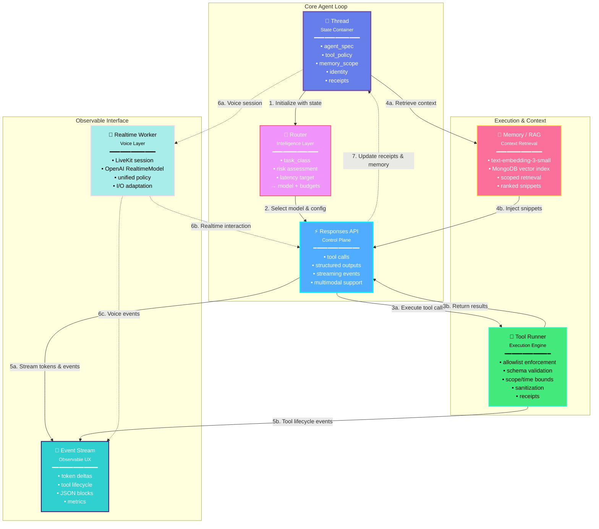

# ChatAndBuild: Agent Runtime Architecture

> **A stateful chat thread driving model orchestration via the Responses API, with server-side tool execution, scoped memory retrieval, and event streaming to the UI.**

---

## 🏗️ Architecture Overview

ChatAndBuild's agent runtime is built on a sophisticated control plane that orchestrates AI interactions through a stateful thread system. This architecture ensures secure, observable, and context-aware AI operations with real-time streaming capabilities.

---

## 🎯 Core Components

### 1. **Thread (State Container)**
The foundational stateful container that maintains:
- Agent specifications and configurations
- Tool execution policies and permissions
- Memory scope and context boundaries
- User identity and session state
- Execution receipts and audit trails

### 2. **Router (Intelligence Layer)**
Dynamic model selection based on:
- **Task Classification**: Reasoning, JSON generation, microtasks, voice, code diffs
- **Risk Assessment**: Security implications and data sensitivity
- **Latency Targets**: Real-time vs. batch processing requirements
- **Budget Constraints**: Token limits and cost optimization

### 3. **Responses API (Control Plane)**
Unified interface providing:
- **Tool Calling**: First-class tool outputs with structured execution
- **Structured Outputs**: Schema-locked JSON artifacts
- **Streaming Events**: Observable UX with real-time updates
- **Multimodal Support**: Text, voice, and future modalities

### 4. **Tool Runner (Execution Engine)**
Server-side tool execution with:
- **Allowlist Enforcement**: Strict permission boundaries
- **Schema Validation**: Type-safe input/output contracts
- **Scope & Time Bounds**: Resource and temporal constraints
- **Sanitization**: Input validation and output cleaning
- **Receipt Generation**: Audit trail for every execution

### 5. **Memory / RAG System**
Embeddings-backed retrieval featuring:
- **text-embedding-3-small**: Efficient vector representations
- **MongoDB Vector Index**: Scalable similarity search
- **Scoped Retrieval**: Permission-aware context fetching
- **Ranked Snippets**: Relevance-ordered results

### 6. **Event Stream (Observable UX)**
Real-time state broadcasting:
- **Token Deltas**: Incremental response generation
- **Tool Lifecycle**: Request → Running → Result → Applied
- **JSON Blocks**: Structured intent/spec/suggestions
- **Performance Metrics**: TTFT, tool time, end-to-end latency

### 7. **Realtime Worker (Voice)**
Optional voice interaction layer:
- **LiveKit Session**: WebRTC-based audio streaming
- **OpenAI RealtimeModel**: Low-latency voice processing
- **Unified Policy**: Same tool and memory constraints
- **I/O Adaptation**: Voice-specific input/output handling

---

## 📊 System Flow Diagram



---

## 🔄 Execution Flow

### Phase 1: Initialization
1. **Thread Creation**: Establish stateful container with agent spec, permissions, and scope
2. **Router Analysis**: Classify task, assess risk, determine optimal model and budget
3. **Context Loading**: Retrieve relevant memory snippets based on scope

### Phase 2: Orchestration
4. **API Invocation**: Send request to Responses API with full context
5. **Streaming Start**: Begin token-by-token response generation
6. **Tool Detection**: Identify and validate tool call requests

### Phase 3: Execution
7. **Tool Running**: Execute tools server-side with strict validation
8. **Result Integration**: Inject tool results back into conversation
9. **Memory Updates**: Store new context and execution receipts

### Phase 4: Delivery
10. **Event Broadcasting**: Stream all state changes to UI
11. **Metrics Collection**: Track TTFT, tool time, end-to-end latency
12. **Session Persistence**: Update thread state with complete history

---

## 🛡️ Security & Governance

### Tool Execution Safety
- ✅ **Server-side Only**: No client-side tool execution
- ✅ **Allowlist Enforcement**: Explicit permission required
- ✅ **Schema Validation**: Type-safe inputs/outputs
- ✅ **Credential Isolation**: Model never sees secrets
- ✅ **Audit Trails**: Complete execution receipts

### Memory & Context
- ✅ **Scoped Retrieval**: Permission-aware access
- ✅ **User Isolation**: Thread/user/workspace boundaries
- ✅ **Ranked Results**: Relevance-based context injection
- ✅ **Embedding Security**: Isolated vector spaces

---

## 📈 Observable Operations

### Real-time Visibility
```
Token Deltas        → Incremental response generation
Tool Lifecycle      → requested → running → result → applied
Structured Blocks   → Intent, specs, suggestions (JSON)
Performance Metrics → TTFT, tool time, end-to-end latency
```

### Event Types
- **Generation Events**: Token streams, completion markers
- **Tool Events**: Invocation, execution, results, errors
- **Memory Events**: Retrieval requests, context injection
- **System Events**: Model selection, budget tracking, errors

---

## 🎤 Voice Integration

The Realtime Worker extends the core runtime to voice interactions:

- **Same Policies**: Tool permissions and memory scope apply
- **LiveKit Transport**: WebRTC-based audio streaming
- **OpenAI RealtimeModel**: Low-latency voice processing
- **Unified Events**: Voice interactions stream to same UI layer

---

## 🚀 Key Advantages

1. **Stateful Intelligence**: Thread-based context preservation
2. **Observable UX**: Real-time visibility into AI operations
3. **Secure Execution**: Server-side tool running with audit trails
4. **Scoped Memory**: Permission-aware context retrieval
5. **Unified Interface**: Single API for text, tools, and voice
6. **Performance Tracking**: Built-in latency and cost monitoring
7. **Multimodal Ready**: Architecture supports future modalities

---

## 🔧 Technical Stack

- **Control Plane**: OpenAI Responses API
- **Embeddings**: text-embedding-3-small
- **Vector Store**: MongoDB with vector indexes
- **Voice**: LiveKit + OpenAI RealtimeModel
- **Streaming**: Server-Sent Events (SSE)
- **State**: Thread-based persistence

---

## 📝 Builder's Perspective

> "Everything starts with the chat thread as a stateful agent container. It has a compiled agent spec, tool permissions, and memory scope. That's the contract."

The architecture prioritizes:
- **Observability**: Users see process, not just answers
- **Security**: Tools execute server-side with strict governance
- **Context**: Memory retrieval is scoped and permission-aware
- **Performance**: Streaming provides immediate feedback
- **Extensibility**: Unified interface supports new capabilities

---

## 🎯 Use Cases

- **Conversational AI**: Context-aware chat with tool access
- **Code Generation**: Secure execution of development tools
- **Voice Assistants**: Real-time voice with tool capabilities
- **RAG Applications**: Scoped memory retrieval with citations
- **Agent Workflows**: Multi-step orchestration with observability

---

## 📚 Further Reading

- [OpenAI Responses API Documentation](https://platform.openai.com/docs/api-reference/responses)
- [LiveKit Real-time Communication](https://livekit.io/)
- [MongoDB Vector Search](https://www.mongodb.com/products/platform/atlas-vector-search)
- [Server-Sent Events (SSE)](https://developer.mozilla.org/en-US/docs/Web/API/Server-sent_events)

---

<div align="center">

**Built with ❤️ by the ChatAndBuild Team**

*Empowering developers with observable, secure, and intelligent AI operations*

</div>
