# ChatAndBuild: Systems Architecture by Planes

> **Enterprise-grade infrastructure view showing the platform's four-plane architecture: Control, Data, Event, and Session planes working in concert to deliver secure, observable, and scalable AI operations.**

---

## 🏛️ Architecture Philosophy

ChatAndBuild's production infrastructure is organized into four distinct **planes**, each with clear responsibilities and boundaries. This separation ensures:

- **Scalability**: Each plane can scale independently based on load
- **Security**: Clear isolation between control, data, and execution layers
- **Observability**: Dedicated event plane for monitoring and metrics
- **Maintainability**: Clean separation of concerns for enterprise operations

---

## 📐 Systems Architecture Diagram

```mermaid
flowchart LR
  %% =========================
  %% Systems Architecture View
  %% Grouped into Planes
  %% =========================

  %% Styling
  classDef controlClass fill:#667eea,stroke:#764ba2,stroke-width:3px,color:#fff
  classDef dataClass fill:#f093fb,stroke:#f5576c,stroke-width:3px,color:#fff
  classDef eventClass fill:#4facfe,stroke:#00f2fe,stroke-width:3px,color:#fff
  classDef sessionClass fill:#43e97b,stroke:#38f9d7,stroke-width:3px,color:#000
  classDef uiClass fill:#fa709a,stroke:#fee140,stroke-width:3px,color:#fff

  %% ---- Control Plane ----
  subgraph CP["🎛️ Control Plane (API + Orchestration)"]
    CP1["NestJS API Gateway<br/><small>Auth/JWT, REST</small>"]:::controlClass
    CP2["Thread & Agent Services<br/><small>thread state, agent spec, policy</small>"]:::controlClass
    CP3["Model Router<br/><small>task class + risk + latency<br/>→ model + budget</small>"]:::controlClass
    CP4["Responses API Client<br/><small>text + tools + JSON + streaming</small>"]:::controlClass
    CP5["Tool Policy Engine<br/><small>allowlist, scopes, escalation</small>"]:::controlClass
  end

  %% ---- Data Plane ----
  subgraph DP["💾 Data Plane (State + Retrieval)"]
    DP1["MongoDB<br/><small>Threads, Users, Receipts</small>"]:::dataClass
    DP2["Vector Index (Mongo)<br/><small>Embeddings: text-embedding-3-small</small>"]:::dataClass
    DP3["Artifacts Store<br/><small>agent specs, suggestion blocks</small>"]:::dataClass
  end

  %% ---- Event Plane ----
  subgraph EP["📡 Event Plane (Streaming + Jobs + Observability)"]
    EP1["WebSocket / Socket.IO<br/><small>Token + Tool Lifecycle Events</small>"]:::eventClass
    EP2["Redis + BullMQ<br/><small>Indexing, async tool jobs</small>"]:::eventClass
    EP3["Metrics/Tracing<br/><small>TTFT, tool latency, schema pass rate</small>"]:::eventClass
  end

  %% ---- Session Plane ----
  subgraph SP["🎤 Session Plane (Realtime Sessions)"]
    SP1["LiveKit Session Runtime<br/><small>Voice worker</small>"]:::sessionClass
    SP2["OpenAI RealtimeModel<br/><small>Interruptible voice</small>"]:::sessionClass
    SP3["Avatar Session (Hedra)<br/><small>Optional visual presence</small>"]:::sessionClass
    SP4["MCP Tools (Firecrawl)<br/><small>Web search/scrape via MCP server</small>"]:::sessionClass
  end

  %% ---- UI ----
  UI["🖥️ Client UI<br/><small>Chat + Agent State</small>"]:::uiClass

  %% ======= Primary Flows =======
  UI -->|"1. messages"| CP1
  CP1 --> CP2
  CP2 -->|"2. load thread state"| DP1
  CP2 --> CP3 --> CP4

  %% Tool execution gating
  CP4 -->|"3a. tool call proposals"| CP5
  CP5 -->|"3b. exec approved tools"| EP2
  EP2 -->|"3c. tool results"| CP4

  %% Retrieval
  CP2 -->|"4a. retrieve"| DP2
  DP2 -->|"4b. scoped snippets"| CP4

  %% Artifacts / receipts
  CP4 -->|"5a. write receipts + artifacts"| DP1
  CP4 -->|"5b. write structured blocks"| DP3

  %% Streaming back to UI
  CP4 -->|"6a. stream tokens/JSON"| EP1
  EP1 --> UI
  EP2 -->|"6b. tool lifecycle"| EP1

  %% Realtime voice sessions (optional)
  UI -.->|"7a. voice start"| SP1
  SP1 --> SP2 --> CP4
  SP1 -.-> SP3
  SP1 -->|"7b. web tools"| SP4
  SP1 -->|"7c. events"| EP1

  %% Observability
  CP4 --> EP3
  EP2 --> EP3
  EP1 --> EP3
```



---

## 🎛️ Control Plane: API & Orchestration

**Purpose**: Request routing, policy enforcement, and AI orchestration

### Components

#### 1. **NestJS API Gateway**
- **Role**: Primary entry point for all client requests
- **Responsibilities**:
  - JWT-based authentication and authorization
  - RESTful API endpoints for chat, threads, agents
  - Request validation and rate limiting
  - CORS and security headers

#### 2. **Thread & Agent Services**
- **Role**: Stateful conversation management
- **Responsibilities**:
  - Thread lifecycle (create, load, update, archive)
  - Agent specification compilation and validation
  - Policy attachment and scope management
  - User identity and workspace isolation

#### 3. **Model Router**
- **Role**: Intelligent model selection
- **Responsibilities**:
  - Task classification (reasoning, JSON, microtasks, voice, code)
  - Risk assessment (security implications, data sensitivity)
  - Latency target evaluation (real-time vs. batch)
  - Budget allocation (token limits, cost optimization)
  - Model selection (GPT-4, GPT-4-turbo, GPT-3.5-turbo, etc.)

#### 4. **Responses API Client**
- **Role**: Unified interface to OpenAI's Responses API
- **Responsibilities**:
  - Text generation with streaming
  - Tool calling orchestration
  - Structured JSON output generation
  - Multimodal request handling
  - Response parsing and validation

#### 5. **Tool Policy Engine**
- **Role**: Security gatekeeper for tool execution
- **Responsibilities**:
  - Allowlist enforcement (per thread/user/workspace)
  - Schema validation for tool inputs
  - Scope and time bound checking
  - Escalation handling for sensitive operations
  - Audit trail generation

### Key Characteristics
- ✅ **Stateless Services**: Horizontal scaling without session affinity
- ✅ **Policy-Driven**: All decisions governed by explicit rules
- ✅ **Observable**: Every operation logged and traced
- ✅ **Secure**: Zero-trust architecture with strict validation

---

## 💾 Data Plane: State & Retrieval

**Purpose**: Persistent storage, vector search, and artifact management

### Components

#### 1. **MongoDB (Primary Store)**
- **Collections**:
  - `threads`: Conversation state, agent specs, policies
  - `users`: Identity, permissions, workspace memberships
  - `receipts`: Tool execution audit trails
  - `messages`: Chat history with metadata
  - `workspaces`: Multi-tenant isolation boundaries

- **Indexes**:
  - Compound indexes on `threadId + timestamp`
  - User-based queries with workspace filtering
  - Receipt lookups by tool and execution time

#### 2. **Vector Index (MongoDB Atlas)**
- **Purpose**: Semantic search for memory retrieval
- **Configuration**:
  - Embedding model: `text-embedding-3-small` (1536 dimensions)
  - Similarity metric: Cosine similarity
  - Index type: HNSW (Hierarchical Navigable Small World)
  
- **Scoped Retrieval**:
  - Thread-level: Conversation-specific context
  - User-level: Personal knowledge base
  - Workspace-level: Shared team knowledge
  
- **Query Flow**:
  1. Embed user query with `text-embedding-3-small`
  2. Vector search with scope filters
  3. Rank by relevance score
  4. Return top-k snippets with citations

#### 3. **Artifacts Store**
- **Purpose**: Structured data and agent configurations
- **Contents**:
  - Agent specifications (tools, prompts, constraints)
  - Suggestion blocks (intent, specs, alternatives)
  - Generated code artifacts
  - Structured JSON outputs
  
- **Access Patterns**:
  - Write-heavy during agent creation
  - Read-heavy during thread initialization
  - Versioned for rollback capabilities

### Key Characteristics
- ✅ **Durable**: All state persisted with replication
- ✅ **Indexed**: Fast retrieval via vector and traditional indexes
- ✅ **Scoped**: Permission-aware data access
- ✅ **Versioned**: Audit trail for all changes

---

## 📡 Event Plane: Streaming, Jobs & Observability

**Purpose**: Real-time updates, asynchronous processing, and system monitoring

### Components

#### 1. **WebSocket / Socket.IO**
- **Purpose**: Real-time bidirectional communication
- **Event Types**:
  - **Token Deltas**: Incremental response generation
  - **Tool Lifecycle**: `requested` → `running` → `result` → `applied`
  - **JSON Blocks**: Structured intent/spec/suggestions
  - **System Events**: Model selection, errors, warnings
  
- **Connection Management**:
  - Per-thread subscriptions
  - Automatic reconnection with backoff
  - Message ordering guarantees
  - Heartbeat for connection health

#### 2. **Redis + BullMQ**
- **Purpose**: Asynchronous job processing
- **Job Types**:
  - **Indexing Jobs**: Embed and index new content
  - **Tool Execution**: Long-running tool operations
  - **Batch Processing**: Bulk operations (exports, migrations)
  - **Scheduled Tasks**: Cleanup, archival, notifications
  
- **Queue Configuration**:
  - Priority queues for latency-sensitive tasks
  - Retry policies with exponential backoff
  - Dead letter queues for failed jobs
  - Rate limiting per job type

#### 3. **Metrics & Tracing**
- **Purpose**: System observability and performance monitoring
- **Metrics Collected**:
  - **Latency**: TTFT (Time to First Token), tool execution time, end-to-end
  - **Throughput**: Requests per second, tokens per second
  - **Quality**: Schema pass rate, tool success rate, user satisfaction
  - **Cost**: Token usage, API calls, compute time
  
- **Tracing**:
  - Distributed tracing across services
  - Request correlation IDs
  - Span annotations for key operations
  - Error tracking and alerting

### Key Characteristics
- ✅ **Real-time**: Sub-second event delivery
- ✅ **Reliable**: At-least-once delivery guarantees
- ✅ **Observable**: Full visibility into system behavior
- ✅ **Scalable**: Horizontal scaling for high throughput

---

## 🎤 Session Plane: Realtime Interactions

**Purpose**: Low-latency voice and avatar sessions with unified tool access

### Components

#### 1. **LiveKit Session Runtime**
- **Purpose**: WebRTC-based real-time communication
- **Capabilities**:
  - Voice streaming with <100ms latency
  - Session management and lifecycle
  - Audio processing and encoding
  - Network adaptation and quality control
  
- **Integration**:
  - Connects to OpenAI RealtimeModel
  - Shares tool policy with Control Plane
  - Streams events to Event Plane
  - Maintains session state in Data Plane

#### 2. **OpenAI RealtimeModel**
- **Purpose**: Low-latency voice AI with interruption support
- **Features**:
  - Streaming speech-to-text
  - Real-time response generation
  - Interruptible conversations
  - Voice activity detection
  
- **Tool Integration**:
  - Same tool allowlist as text threads
  - Voice-specific input/output adaptation
  - Unified policy enforcement
  - Shared memory retrieval

#### 3. **Avatar Session (Hedra)**
- **Purpose**: Optional visual presence for voice interactions
- **Capabilities**:
  - Lip-sync with voice output
  - Emotion and gesture synthesis
  - Real-time rendering
  - Multi-avatar support
  
- **Use Cases**:
  - Customer service agents
  - Educational tutors
  - Virtual assistants
  - Brand ambassadors

#### 4. **MCP Tools (Firecrawl)**
- **Purpose**: Web search and scraping via Model Context Protocol
- **Capabilities**:
  - Real-time web search
  - Page content extraction
  - Structured data parsing
  - Rate-limited API access
  
- **Integration**:
  - MCP server for tool definitions
  - Unified tool policy enforcement
  - Result caching for efficiency
  - Error handling and fallbacks

### Key Characteristics
- ✅ **Low Latency**: <100ms voice round-trip
- ✅ **Unified Policy**: Same security as text threads
- ✅ **Observable**: Events stream to same UI layer
- ✅ **Extensible**: Plugin architecture for new modalities

---

## 🔄 Cross-Plane Interactions

### Primary Request Flow
1. **Client → Control**: User sends message via API Gateway
2. **Control → Data**: Load thread state and retrieve memory
3. **Control → Control**: Route to model, enforce policies
4. **Control → Event**: Stream tokens and tool lifecycle
5. **Event → Client**: Real-time updates via WebSocket
6. **Control → Data**: Persist receipts and artifacts

### Tool Execution Flow
1. **Control**: Responses API proposes tool call
2. **Control**: Policy Engine validates against allowlist
3. **Event**: BullMQ job created for execution
4. **Event**: Tool runs with scope/time bounds
5. **Event**: Results sanitized and validated
6. **Control**: Results injected back into conversation
7. **Data**: Receipt written for audit trail

### Memory Retrieval Flow
1. **Control**: Thread service requests context
2. **Data**: Embed query with `text-embedding-3-small`
3. **Data**: Vector search with scope filters
4. **Data**: Rank and return top-k snippets
5. **Control**: Inject snippets into prompt
6. **Event**: Log retrieval metrics

### Voice Session Flow
1. **Client → Session**: Initiate LiveKit session
2. **Session → Control**: Connect to RealtimeModel
3. **Session → Control**: Share tool policy
4. **Control → Session**: Stream voice responses
5. **Session → Event**: Broadcast lifecycle events
6. **Event → Client**: Real-time voice updates

---

## 🛡️ Security Architecture

### Defense in Depth
- **Layer 1 (Edge)**: API Gateway with JWT validation
- **Layer 2 (Control)**: Policy Engine with allowlist enforcement
- **Layer 3 (Data)**: Scoped retrieval with permission checks
- **Layer 4 (Event)**: Sanitized outputs before streaming
- **Layer 5 (Session)**: Isolated voice sessions with unified policy

### Key Security Principles
- ✅ **Zero Trust**: Every request validated at every layer
- ✅ **Least Privilege**: Minimal permissions by default
- ✅ **Audit Everything**: Complete execution trails
- ✅ **Fail Secure**: Errors deny access, not grant it
- ✅ **Credential Isolation**: Models never see secrets

---

## 📊 Scalability & Performance

### Horizontal Scaling
- **Control Plane**: Stateless services behind load balancer
- **Data Plane**: MongoDB sharding and read replicas
- **Event Plane**: Redis cluster and BullMQ workers
- **Session Plane**: LiveKit SFU (Selective Forwarding Unit)

### Performance Targets
- **TTFT**: <500ms for text, <100ms for voice
- **Tool Execution**: <2s for most operations
- **Memory Retrieval**: <200ms for vector search
- **Event Delivery**: <50ms WebSocket latency

### Resource Optimization
- **Caching**: Redis for hot data and rate limits
- **Connection Pooling**: Reuse DB and API connections
- **Batch Processing**: Group operations where possible
- **Lazy Loading**: Defer non-critical operations

---

## 🔧 Operational Excellence

### Monitoring & Alerting
- **Health Checks**: Per-service liveness and readiness probes
- **Metrics Dashboards**: Real-time system performance
- **Error Tracking**: Automatic issue detection and grouping
- **SLA Monitoring**: Uptime, latency, and error rate tracking

### Deployment & CI/CD
- **Blue-Green Deployments**: Zero-downtime releases
- **Canary Releases**: Gradual rollout with monitoring
- **Automated Testing**: Unit, integration, and E2E tests
- **Rollback Procedures**: One-click revert on issues

### Disaster Recovery
- **Backups**: Automated daily snapshots with retention
- **Replication**: Multi-region data redundancy
- **Failover**: Automatic promotion of replicas
- **Recovery Time**: <15 minutes for critical services

---

## 🎯 Enterprise Benefits

### For Technical Leaders
- **Clear Separation**: Four planes with distinct responsibilities
- **Proven Stack**: NestJS, MongoDB, Redis, LiveKit, OpenAI
- **Observable**: Full visibility into system behavior
- **Scalable**: Horizontal scaling at every layer

### For Security Teams
- **Zero Trust**: Every request validated at every layer
- **Audit Trails**: Complete execution history
- **Credential Isolation**: Models never see secrets
- **Compliance Ready**: SOC 2, GDPR, HIPAA patterns

### For Product Teams
- **Real-time UX**: Streaming tokens and tool lifecycle
- **Multimodal**: Text, voice, and avatar support
- **Extensible**: Plugin architecture for new capabilities
- **Reliable**: 99.9% uptime SLA

---

## 📚 Technology Stack

### Control Plane
- **Framework**: NestJS (TypeScript)
- **API**: REST + GraphQL
- **Auth**: JWT with refresh tokens
- **Validation**: class-validator, class-transformer

### Data Plane
- **Database**: MongoDB Atlas
- **Vector Search**: MongoDB Atlas Vector Search
- **Embeddings**: OpenAI text-embedding-3-small
- **Caching**: Redis

### Event Plane
- **WebSockets**: Socket.IO
- **Job Queue**: BullMQ
- **Message Broker**: Redis
- **Metrics**: Prometheus + Grafana

### Session Plane
- **Voice**: LiveKit + OpenAI RealtimeModel
- **Avatar**: Hedra API
- **MCP**: Firecrawl MCP server
- **WebRTC**: LiveKit SFU

---

## 🚀 Deployment Architecture

```
┌─────────────────────────────────────────────────────────────┐
│                     Load Balancer (HTTPS)                    │
└─────────────────────────────────────────────────────────────┘
                              │
                ┌─────────────┴─────────────┐
                │                           │
        ┌───────▼────────┐         ┌───────▼────────┐
        │  Control Plane │         │  Session Plane │
        │   (NestJS)     │         │   (LiveKit)    │
        │   Replicas: 3+ │         │   Replicas: 2+ │
        └───────┬────────┘         └───────┬────────┘
                │                           │
        ┌───────▼────────┐         ┌───────▼────────┐
        │   Data Plane   │         │   Event Plane  │
        │   (MongoDB)    │         │ (Redis+BullMQ) │
        │   Replicas: 3  │         │   Replicas: 3  │
        └────────────────┘         └────────────────┘
```


<div align="center">

**Built with ❤️ by the ChatAndBuild Team**

</div>
