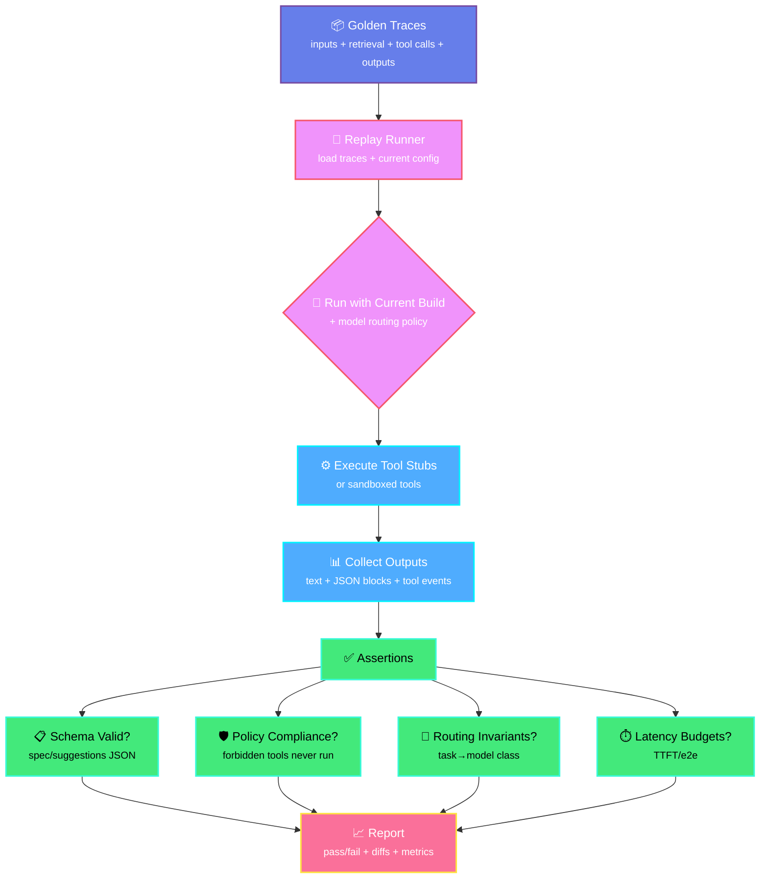

# Evals Harness: Preventing Regressions as Models + Prompts Evolve

> **Evals pipeline — rare, impressive, safe**

---

## 🎯 Philosophy: Test Agent Behavior Like Software (Not Vibes)

**Models change. Prompts change. Tools change.**  
Without evals + replay, behavior drifts silently.

LLM systems need more than standard API testing, they require **behavioral regression testing**. We don't expect identical text outputs, but we do expect:
- The right tools to be called
- JSON to validate against schemas
- Forbidden tools to never run
- Policy to be respected at all times

**If builders take one thing: treat agent behavior as something you can test, not something you eyeball.**

---

## 🧪 Testing Architecture

### 1. API Contract Tests (Jest + Supertest)

*"We do standard API testing: Jest/Supertest ensures endpoints behave, auth works, schemas return, etc."*

Standard endpoint validation ensuring:

#### **Chat Endpoints**
- Message handling and streaming
- Error cases and edge conditions
- Authentication and authorization
- Rate limiting behavior

#### **Agent Creation/Spec Compilation Endpoints**
- Schema validation
- Policy attachment
- Tool allowlist enforcement
- Spec compilation correctness

#### **RAG Indexing/Retrieval Endpoints**
- Embedding generation
- Vector search accuracy
- Scope filtering (thread/user/workspace)
- Relevance scoring

---

### 2. Trace Replay System

*"But LLM systems need a second layer: behavioral regression testing."*

*"Trace replay is the key: record the agent's decision trail—not only the final answer, but tool calls, retrieval, and structured outputs."*

The key to preventing silent behavior drift:

#### **Record Phase**
Capture the complete decision trail:
- **Inputs**: User messages and context
- **Retrieved snippets**: Memory with relevance scores
- **Tool calls**: Proposed tools and arguments
- **Tool results**: Execution outputs
- **Outputs**: Final text + structured JSON
- **Metadata**: Model used, latency, token counts

#### **Replay Phase**
*"Then when we update prompts or change routing or adopt a new OpenAI model variant, we replay old traces and assert invariants."*

Run against new builds:
- Apply current prompt templates
- Use current model routing policy
- Execute tool stubs or sandboxed tools
- Collect outputs and events

#### **Diff Phase**
*"We don't expect identical text. We expect the right tools to be called, JSON to validate, forbidden tools to never run, and policy to be respected."*

Verify invariants:
- Compare against golden traces
- Flag regressions with detailed reports
- Track metrics over time

---

### 3. Assertion Framework

We enforce four categories of invariants:

#### **Schema Validity**
- Agent spec JSON must parse and match schema
- Suggestion blocks must conform to expected structure
- Tool input/output schemas must validate
- Structured outputs must be well-formed

#### **Tool-Policy Compliance**
- **Forbidden tools never execute** (hard constraint)
- Side effects require escalation/confirmation
- Scope bounds respected (thread/user/workspace)
- Time bounds enforced (no runaway executions)

#### **Routing Invariants**
- Task classes map to expected model families:
  - `reasoning` → GPT-4 class models
  - `json` → Models with structured output support
  - `microtasks` → Fast, cost-effective models
  - `voice` → RealtimeModel
  - `code` → Code-specialized models

#### **Latency Budgets**
- **TTFT (Time to First Token)**: <500ms for text, <100ms for voice
- **Tool execution time**: <2s for most operations
- **End-to-end latency**: <3s for complete responses

---

## 📊 Evals Pipeline Flow



---

## 💻 Example Test Cases

### Chat Endpoint Regression
```typescript
describe('Chat API - Trace Replay', () => {
  it('should maintain tool calling behavior after prompt update', async () => {
    const trace = await loadGoldenTrace('chat-with-calculator-tool');
    const result = await replayTrace(trace);
    
    // Assert tool was called (not exact args)
    expect(result.toolCalls).toContainTool('calculator');
    
    // Assert policy was respected
    expect(result.policyViolations).toHaveLength(0);
    
    // Assert schema validity
    expect(result.outputs).toMatchSchema(AgentOutputSchema);
    
    // Assert latency budget
    expect(result.metrics.ttft).toBeLessThan(500);
  });
});
```

### Agent Spec Compilation
```typescript
describe('Agent Spec - Schema Validation', () => {
  it('should reject specs with forbidden tools', async () => {
    const spec = {
      tools: ['web_search', 'execute_code'], // execute_code is forbidden
      prompt: 'You are a helpful assistant'
    };
    
    const result = await compileAgentSpec(spec);
    
    expect(result.errors).toContain('Tool "execute_code" not in allowlist');
    expect(result.compiled).toBe(false);
  });
});
```

### RAG Retrieval Quality
```typescript
describe('RAG - Retrieval Accuracy', () => {
  it('should retrieve relevant snippets within scope', async () => {
    const trace = await loadGoldenTrace('rag-query-with-workspace-scope');
    const result = await replayTrace(trace);
    
    // Assert retrieval happened
    expect(result.retrievedSnippets).toHaveLength(trace.expectedSnippetCount);
    
    // Assert scope was respected
    result.retrievedSnippets.forEach(snippet => {
      expect(snippet.scope).toBe('workspace');
      expect(snippet.workspaceId).toBe(trace.workspaceId);
    });
    
    // Assert relevance threshold
    expect(result.metrics.avgRelevanceScore).toBeGreaterThan(0.7);
  });
});
```

---

## 🔄 Continuous Integration

Evals run automatically on:
- **Every PR**: Catch regressions before merge
- **Nightly builds**: Full suite against production data
- **Model updates**: Validate behavior with new OpenAI releases
- **Prompt changes**: Ensure intent preservation
- **Tool additions**: Verify policy enforcement

---

## 📈 Metrics Dashboard

Track over time:
- **Pass rate**: Percentage of traces passing all assertions
- **Regression rate**: New failures introduced per build
- **Latency trends**: TTFT, tool time, end-to-end over time
- **Schema compliance**: Percentage of valid structured outputs
- **Policy violations**: Count and severity of security issues
- **Cost efficiency**: Token usage and API call patterns

---

## ✅ Key Benefits

- **Catch Silent Drift**: Detect behavior changes before users do
- **Safe Iteration**: Confidently update prompts and models
- **Policy Enforcement**: Automated security validation
- **Performance Tracking**: Latency and cost monitoring
- **Compliance Ready**: Audit trail for all agent decisions

---

## 🛠️ Technology Stack

- **Unit Tests**: Jest
- **API Tests**: Supertest
- **Evals**: Custom trace replay framework
- **CI/CD**: GitHub Actions with automated evals
- **Metrics**: Prometheus + Grafana

---

<div align="center">

**Built with ❤️ by the ChatAndBuild Team**

*The difference between shipping and praying*

</div>
